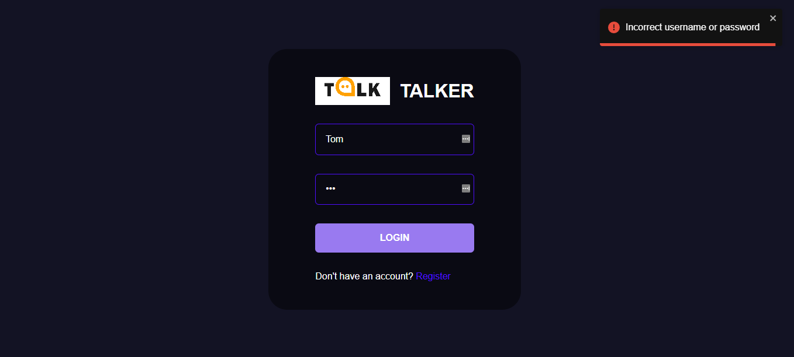
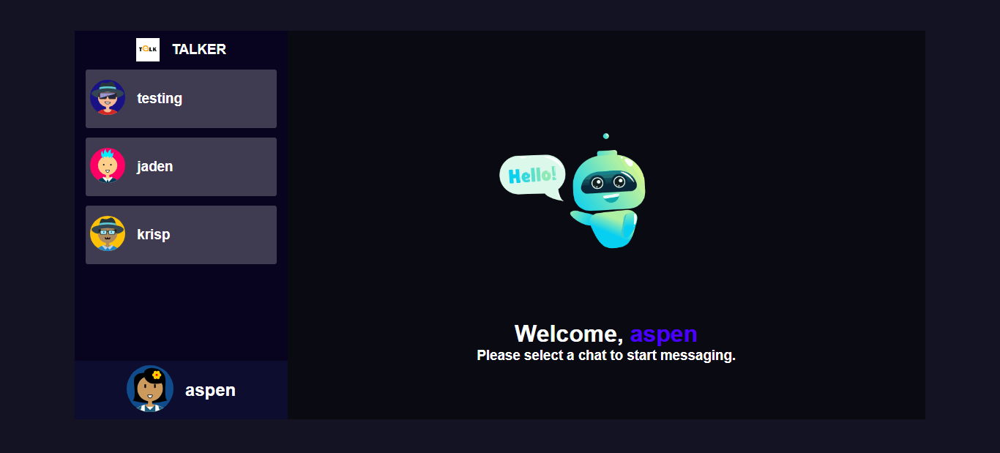

# Getting Started

## To Begin, Register

## Choose an Avatar

## Login

## Welcome

## Single Chat

## Double Chats

## Available Scripts

### To run the frontend (React)

Move into the client directory, and run:

### `npm start`

### To run the backend

Move into the server directory, and run:

### `npm run dev`

Runs the app in the development mode.\
Open [http://localhost:3000](http://localhost:3000) to view it in your browser.

The page will reload when you make changes.\
You may also see any lint errors in the console.

## Deployment

You can find a demo of Talker-ChatApp at ...